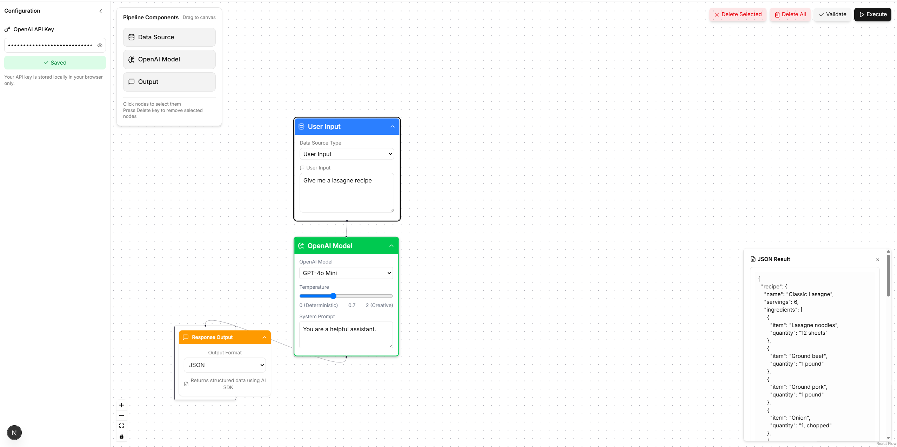

# LLM Workflow Studio

A visual pipeline builder for creating AI workflows with OpenAI models.



## Features

- Drag-and-drop interface for building AI pipelines
- Connect data sources to OpenAI models
- Configure model parameters like temperature and system prompts
- Execute pipelines and view results in real-time
- Support for text and JSON outputs

## Getting Started

1. Clone this repository
2. Install dependencies:
   ```bash
   pnpm install
   ```
3. Run the development server:
   ```bash
   pnpm dev
   ```
4. Open [http://localhost:3000](http://localhost:3000) in your browser

## Usage

1. Add your OpenAI API key in the sidebar
2. Drag nodes from the sidebar onto the canvas
3. Connect nodes by dragging from one handle to another
4. Configure node parameters by clicking on them
5. Click "Validate" to check your pipeline
6. Click "Execute" to run your pipeline
7. View results in the output panel

## Built With

- [Next.js](https://nextjs.org/)
- [ReactFlow](https://reactflow.dev/)
- [OpenAI API](https://openai.com/)
